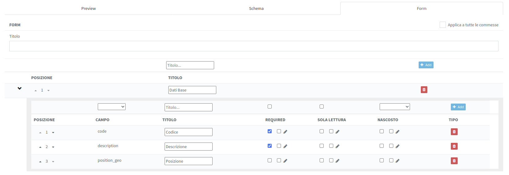

# Editing models form
 
## Model analisys

Forms models are based on JSON object coarsely shown in the following.

This is  a simple example structure persisted on backend server database and used as a template every time pages need to show a model to the user as, in example, to render a grid, a CRUD form or a search one. This structure is going to be used in rendering as explained below.

To give an idea let me show an example of such metadata model:
```
{
  "dataOut": null,
  "schemaVersion": null,
  "creationUser": null,
  "treeUUID": null,
  "import_id": null,
  "columndefsCrossCommission": true,
  "creationDate": "2019-07-30T13:46:27.000Z",
  "columndefsCommission": "2200001",
  "version": "AX__fzbbKx9K-N9kvEsw",
  "tags": null,
  "schemaCode": "schema",
  "previousVersion": "AXF4AksYmb61S4JIKjer",
  "model": {
    "schema": {
      "type": "object",
      "title": "",
      "properties": {
        "code": {
          "check": true,
          "title": "Codice",
          "type": "string"
        },
        "position_geo": {
          "enableFiltering": true,
          "check": true,
          "title": "Posizione",
          "type": "geopoint",
          "enableSorting": true
        },
        "description": {
          "check": true,
          "title": "Descrizione",
          "type": "string"
        }
      },
      "required": [
        "code",
        "description"
      ]
    },
    "code": "aeroporto",
    "form": [
      {
        "type": "fieldset",
        "items": [
          {
            "tabs": [
              {
                "title": "Dati Base",
                "items": [
                  {
                    "title": "Codice",
                    "type": "text",
                    "key": [
                      "code"
                    ],
                    "required": true
                  },
                  {
                    "title": "Descrizione",
                    "type": "text",
                    "key": [
                      "description"
                    ],
                    "required": true
                  },
                  {
                    "title": "Posizione",
                    "type": "geopoint",
                    "key": [
                      "position_geo"
                    ]
                  }
                ]
              }
            ],
            "type": "tabs"
          }
        ]
      }
    ],
    "columndefsCrossCommission": false,
    "description": "Aeroporto",
    "history": true,
    "drawingManagement": true,
    "columndefsCommission": "1900013",
    "columnDefs": [
      {
        "field": "code",
        "name": "Codice"
      },
      {
        "field": "description",
        "name": "Descrizione"
      },
      {
        "field": "position_geo",
        "name": "Posizione"
      }
    ],
    "commissionDependent": true,
    "attachmentManagement": true
  },
  "commission": null,
  "UUID": "aeroporto",
  "user": "polist",
  "dataIn": "2022-04-06T15:30:01.000Z",
  "customer": null,
  "parents": null
}
```

At fist glance, aside the element  "code": "aeroporto" outlining the object name ("aeroporto") as attribute of the "code" field,
three main parts may be described :

1) consider here the object "properties" as metadata definition for informative content of the object; in this example the definition of the object is made by three data type: two "string" and one "geopoint" as a complex definition of member attribute "position_geo" 

```
  "model": {
    "schema": {
      "type": "object",
      "title": "",
      "properties": {
        "code": {
          "check": true,
          "title": "Codice",
          "type": "string"
        },
        "position_geo": {
          "enableFiltering": true,
          "check": true,
          "title": "Posizione",
          "type": "geopoint",
          "enableSorting": true
        },
        "description": {
          "check": true,
          "title": "Descrizione",
          "type": "string"
        }
      },
      "required": [
        "code",
        "description"
      ]
    },
    .........
```

In a nutshell and for few element consider the following explanation:

> - "enableFiltering": if true can be used in filtering
> - "check": [??????]
> - "title": label over form explainig the required data
> - "type": which kind of data is expecting, a primitive one (string, number, date,...) or a complex one (as ex. "geopoint"). In the latter, the renderig must count un the specific definition
> - "enableSorting": [??????]
> - ecc. ecc.

2) "columnDefs" as array of JSON objects defining the field name ("field") and the label ("name") and used in rendering the grid header:

```
    "columnDefs": [
      {
        "field": "code",
        "name": "Codice"
      },
      {
        "field": "description",
        "name": "Descrizione"
      },
      {
        "field": "position_geo",
        "name": "Posizione"
      }
    ],
```
  3) The section "form" is an array defining the kind of form ("type" and "tabs") and the fields sequence

```
  ....
    "code": "aeroporto",
    "form": [
      {
        "type": "fieldset",
        "items": [
          {
            "tabs": [
              {
                "title": "Dati Base",
                "items": [
                  {
                    "title": "Codice",
                    "type": "text",
                    "key": [
                      "code"
                    ],
                    "required": true
                  },
                  {
                    "title": "Descrizione",
                    "type": "text",
                    "key": [
                      "description"
                    ],
                    "required": true
                  },
                  {
                    "title": "Posizione",
                    "type": "geopoint",
                    "key": [
                      "position_geo"
                    ]
                  }
                ]
              }
            ],
            "type": "tabs"
          }
        ]
      }
    ],
.....
```
> -  "title" as the field label
> -  "type" the kind of rendering in the form
> -  "key" the object model in the form, the variable holding the field value
> -  "required" self explanatory

***

## Filter and search form 


### Tag filter


### Header filters

### Further filters

***

## CRUD and options: current form layout 

### whole form view


The sketch above shows an example layout of an editing form dedicated to an object model; each section is going to explain in following sections. 
Any new model have to be created by scratch starting from the default JSON data structure outlined in **Notes**  point **1**.

**1. Form upper side:**


**here goes the default from the start-->**
...
...
"columndefsCrossCommission": false,
	"UUID": "aeroporto",
	"dataIn": "2022-04-24T22:00:00.000Z",
	"dataOut": "2022-06-04T22:00:00.000Z",
	"tags": [
		"bah"
	]
**here terminating closing bracket-->}**

| **Label on form**                   | **JSON field**        |
|-------------------------------------|-----------------------|
| version(by code, no user input)     | version               |
| UUID                                | UUID                  |
| Inizio validità                     | dataIn                |
| Fine validità:                      | dataOut               |
| tag                                 | tags[]                |
| Tipo                                | model.code            |
| Descrizione                         | model.description     |


**2. Form configuration side**


configuration

| **Label on form**      | **JSOM field**      |
|------------------------|---------------------|
| Dipendente da commessa | commissionDependent |
| Gestione calendario    | calendarManagement  |
|                        |                     |
|                        |                     |
|                        |                     |
|                        |                     |
|                        |                     |

***

**3. Form expanding panel**


| **Label on form**      | **JSOM field**      |
|------------------------|---------------------|
|                        |                     |
|                        |                     |
|                        |                     |
|                        |                     |
|                        |                     |

**3.1 Form advanced section**


| **Label on form**      | **JSOM field**      |
|------------------------|---------------------|
|                        |                     |
|                        |                     |
|                        |                     |
|                        |                     |
|                        |                     |

**3.2 Form export template**


| **Label on form**      | **JSOM field**      |
|------------------------|---------------------|
|                        |                     |
|                        |                     |
|                        |                     |
|                        |                     |
|                        |                     |

**3.3 Form QR code template**


| **Label on form**      | **JSOM field**      |
|------------------------|---------------------|
|                        |                     |
|                        |                     |
|                        |                     |
|                        |                     |
|                        |                     |

**4. Form setup template**

**4.1 Form preview**


**4.2 Form schema**


**4.3 Form layout**


***

## Tree modelling


***

## Model importing 


# Notes:
**1.starting scratch default structure on new model appending** 
```
{
	"model": {
		"schema": {
			"type": "object",
			"title": "",
			"properties": {
				"code": {
					"title": "Codice",
					"type": "string",
					"check": true,
					"enableFiltering": true,
					"enableSorting": true
				},
				"description": {
					"title": "Descrizione",
					"type": "string",
					"check": true,
					"enableFiltering": true,
					"enableSorting": true
				}
			},
			"required": [
				"code",
				"description"
			]
		},
		"form": [
			{
				"type": "fieldset",
				"items": [
					{
						"type": "tabs",
						"tabs": [
							{
								"title": "Dati Base",
								"items": [
									{
										"key": [
											"code"
										],
										"title": "Codice",
										"required": true,
										"type": "text"
									},
									{
										"key": [
											"description"
										],
										"title": "Descrizione",
										"required": true,
										"type": "text"
									}
								]
							}
						]
					}
				],
				"crossCommission": false
			}
		],
		"reports": [],
		"columnDefs": [
			{
				"field": "code",
				"name": "Codice"
			},
			{
				"field": "description",
				"name": "Descrizione"
			}
		]
	},
	"columndefsCrossCommission": false
}
```
***
 **Formly way**

Probably this open source component will be used in building forms. Component description can be found at: 
> - <https://formly.dev/guide/getting-started>.